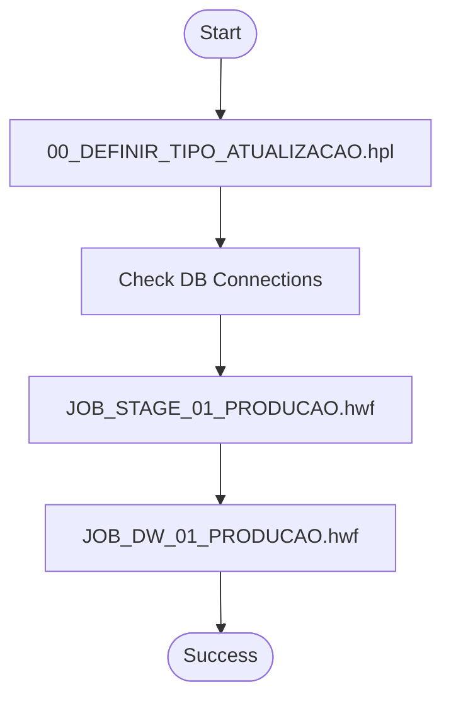
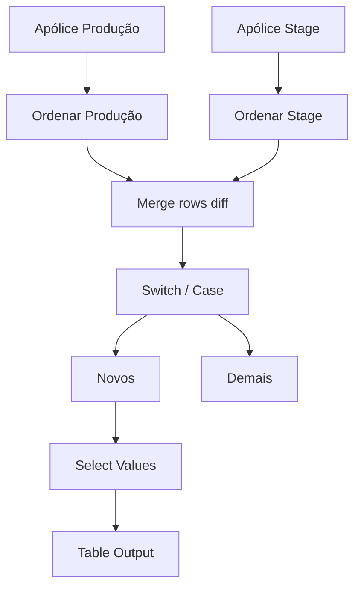
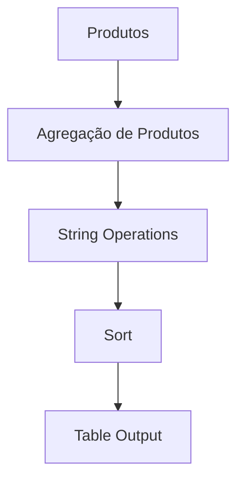

# APACHE_HOP_01_PRODUCAO

    

Projeto de ETL utilizando Apache Hop para orquestração de pipelines de dados em ambiente de produção.

---

## Sumário
- [Descrição Geral](#descricao-geral)
- [Estrutura de Pastas](#estrutura-de-pastas)
- [Detalhamento dos Arquivos e Processos](#detalhamento-dos-arquivos-e-processos)
- [Fluxogramas dos Principais Processos](#fluxogramas-dos-principais-processos)
- [Como Executar](#como-executar)
- [Requisitos](#requisitos)

---

## Descrição Geral { #descricao-geral }
Este repositório contém jobs, pipelines e scripts para processamento, transformação e carga de dados, organizados para facilitar a manutenção e execução em ambiente produtivo. O projeto é modular, com separação clara entre etapas de preparação (stages), orquestração (jobs) e carga no Data Warehouse (DW).

---

## Estrutura de Pastas
```
├── 00_Centro_custos.hpl
├── 00_Grade_comercial.hpl
├── 01_PARC_MOVTO.hpl
├── ...
├── 01_PRODUCAO_JOBS/
│   ├── 00_DEFINIR_TIPO_ATUALIZACAO.hpl
│   ├── 00_JOB_PRINCIPAL_01_PRODUCAO.hwf
│   ├── ...
├── 02_STAGES_PRODUCAO/
│   ├── 00_DIMENCOES.hpl
│   ├── ...
├── 03_DW_PRODUCAO/
│   ├── 01_dim_linha_negocio.hpl
│   ├── ...
├── project-config.json
├── README.md
```

---

## Detalhamento dos Arquivos e Processos

### Raiz do Projeto
- **00_Centro_custos.hpl**: Processa dados de centros de custos, normaliza, agrupa, separa alocações diretas/indiretas e grava em tabelas dimensionais.
- **00_Grade_comercial.hpl**: Trata a grade comercial, verifica nulos, aplica fórmulas, ordena e remove duplicidades.
- **01_PARC_MOVTO.hpl**: Movimentação de parcelas, executa consulta SQL e encaminha dados para destino.
- **02_CORP_SUB_CORRETOR.hpl**: Consulta e trata dados de subcorretor, juntando informações de endossos, pessoas e percentuais de comissão.
- **03_CORP_INDICADOR_COTACAO.hpl**: Processa indicadores de cotação e grava em tabela de saída.
- **04_TESTE.hpl**: Pipeline de teste, gera linhas fictícias, faz cálculos e grava em tabela de saída.

### 01_PRODUCAO_JOBS
- **00_DEFINIR_TIPO_ATUALIZACAO.hpl**: Define o tipo de atualização (incremental, mensal, full), seta variáveis globais.
- **00_JOB_PRINCIPAL.hwf**: Job principal de orquestração, executa pipelines e controla o fluxo ETL.
- **00_JOB_PRINCIPAL_01_PRODUCAO.hwf**: Job principal do ambiente produtivo, verifica conexões e orquestra a execução dos jobs.
- **JOB_DW_01_PRODUCAO.hwf**: Orquestra a carga das dimensões e fatos no DW.
- **job_hop.bat**: Script para execução automatizada do job principal.
- **JOB_STAGE_01_PRODUCAO.hwf**: Orquestra a execução dos stages de produção.

### 02_STAGES_PRODUCAO
- **00_DIMENCOES.hpl**: Trata dimensões do negócio, remove duplicidades e prepara para carga no DW.
- **00_STEP_DELETE_STAGE.hpl**: Limpa dados intermediários (stages) antes de novas cargas.
- **01_CORP_APOLICE.hpl**: Processa apólices, identifica diferenças entre produção e stage.
- **01_CORP_APOLICE_2.hpl**: Busca apólice com maior data de emissão, prepara para atualização incremental.
- **01_STEP_DELETE_STAGE_DIARIA.hpl**: Limpeza diária de stages.
- **02_CORP_SUB_ESTIPULANTE.hpl**: Processa subestipulantes, identifica diferenças e prepara para atualização.
- **03_CORP_ENDOSSO.hpl**: Processa endossos, identifica diferenças e prepara para atualização.
- **05_CORP_MOVTO_AGRUP.hpl**: Movimentações agrupadas, identifica diferenças e prepara para atualização.
- **06_CORP_MOVTO_EMISSAO_AGRUPADA.hpl**: Emissão agrupada, inclui truncate table e grava destino.
- **07_PRODUCAO_SEGURADORA.hpl**: Processa produção de seguradora, grava em tabela de saída.
- **08_PRODUCAO_SEGURADORA_ENDOSSOS.hpl**: Processa endossos de seguradora, identifica diferenças e prepara para atualização.
- **09_ENDOSSOS_EMITIDOS.hpl**: Consulta endossos emitidos e grava em tabela de saída.
- **10_CORP_PESSOAS.hpl**: Processa pessoas, identifica diferenças e prepara para atualização.
- **11_CORP_INADIMPLENCIA.hpl**: Consulta inadimplência e grava em tabela de saída.
- **12_CORP_RECEBIMENTOS.hpl**: Consulta recebimentos e grava em tabela de saída.
- **13_RCO_UTILIZACAO.hpl**: Consulta utilizações e grava em tabela de saída.
- **14_RCO_RENOVACAO.hpl**: Consulta renovações e grava em tabela de saída.

### 03_DW_PRODUCAO
- **01_dim_linha_negocio.hpl**: Trata e grava dimensão linha de negócio.
- **02_dim_produto.hpl**: Agrega, padroniza e grava dimensão produto.
- **03_dim_corretor.hpl**: Padroniza, gera chaves e grava dimensão corretor.
- **04_dim_evento.hpl**: Remove duplicidades, padroniza e grava dimensão evento.
- **05_dim_ramo.hpl**: Padroniza, concatena e grava dimensão ramo.
- **06_dim_grade_assessorias.hpl**: Padroniza, ordena e grava dimensão assessorias.
- **20_FATO_PRODUCAO_TESTE.hpl**: Pipeline de teste para carga de fato de produção, identifica diferenças e prepara para atualização.

---

## Fluxogramas dos Principais Processos

### Orquestração Principal (Job Produção)


### Exemplo de Pipeline de Stage (Apólice)


### Exemplo de Pipeline de Dimensão (Produto)


---

## Como Executar
1. Abra o Apache Hop GUI.
2. Importe o projeto ou navegue até a pasta do repositório.
3. Execute o job principal localizado em `01_PRODUCAO_JOBS/00_JOB_PRINCIPAL_01_PRODUCAO.hwf`.
4. Acompanhe os logs e resultados pela interface do Hop.

## Requisitos
- Apache Hop instalado ([documentação oficial](https://hop.apache.org/))
- Java 8+

---
##  Contato

Para dúvidas, sugestões ou reportar problemas:

| Canal | Informação |
|-------|------------|
| **Email** | [thiago.ramalho@kovr.com.br](mailto:thiago.ramalho@kovr.com.br) |
| **Email** | [usrpbi@kovr.com.br](mailto:usrpbi@kovr.com.br) |

