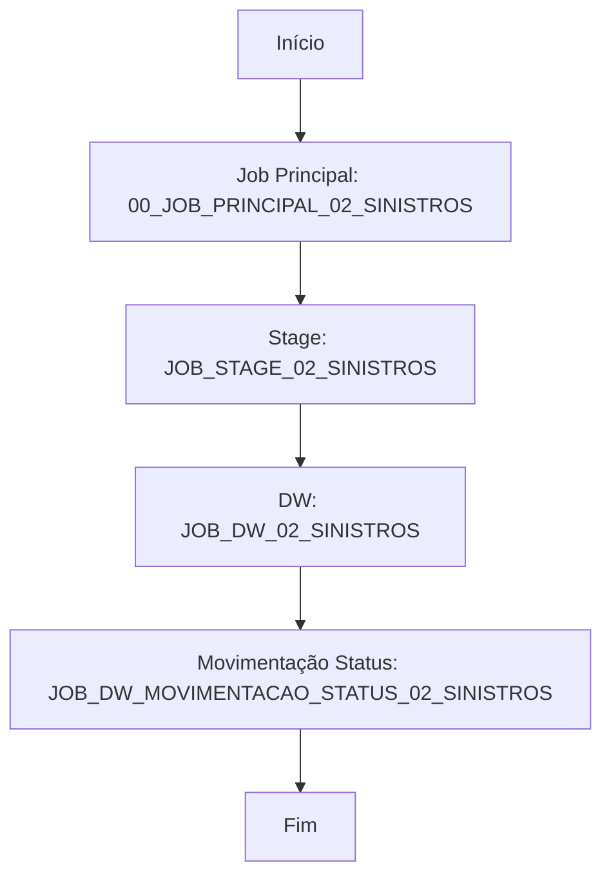
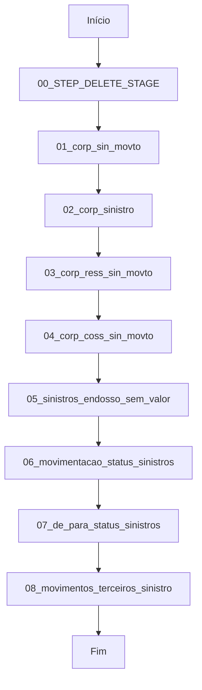
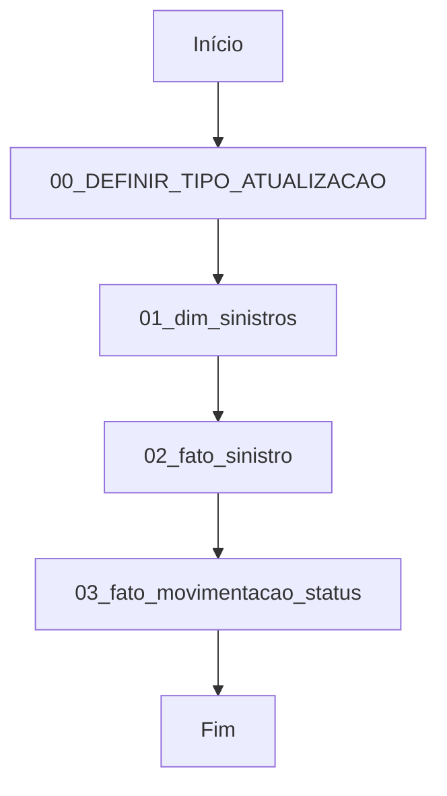

# APACHE_HOP_02_SINISTROS

    

Projeto de ETL utilizando Apache Hop para orquestração de pipelines de dados relacionados a sinistros, movimentações e dimensões em ambiente de produção.

---

## Sumário
- [Descrição Geral](#descricao-geral)
- [Estrutura de Pastas](#estrutura-de-pastas)
- [Detalhamento dos Arquivos e Processos](#detalhamento-dos-arquivos-e-processos)
- [Fluxogramas dos Principais Processos](#fluxogramas-dos-principais-processos)
- [Como Executar](#como-executar)
- [Requisitos](#requisitos)

---

## Descrição Geral { #descricao-geral }
Este projeto tem como objetivo centralizar e automatizar o fluxo ETL de dados de sinistros, movimentações e dimensões, utilizando Apache Hop. A modularidade do projeto permite fácil manutenção, expansão e integração com outros sistemas de dados.

---

## Estrutura de Pastas
```
project-config.json
README.md
01_SINISTROS_JOBS/
	00_JOB_PRINCIPAL_02_SINISTROS.hwf
	JOB_DW_02_SINISTROS.hwf
	JOB_DW_MOVIMENTACAO_STATUS_02_SINISTROS.hwf
	JOB_STAGE_02_SINISTROS.hwf
02_STAGE_SINISTROS/
	00_STEP_DELETE_STAGE.hpl
	01_corp_sin_movto.hpl
	02_corp_sinistro.hpl
	03_corp_ress_sin_movto.hpl
	04_corp_coss_sin_movto.hpl
	05_sinistros_endosso_sem_valor.hpl
	06_movimentacao_status_sinistros.hpl
	07_de_para_status_sinistros.hpl
	08_movimentos_terceiros_sinistro.hpl
03_DW_SINISTROS/
	00_DEFINIR_TIPO_ATUALIZACAO.hpl
	01_dim_sinistros.hpl
	02_fato_sinistro.hpl
	03_fato_movimentacao_status.hpl
```

---

## Detalhamento dos Arquivos e Processos

### Raiz do Projeto
- project-config.json: Configurações gerais do projeto Hop.
- README_HOP.prompt.md: Modelo e instruções para documentação padronizada.
- README.md: Documentação principal do projeto.

### 01_SINISTROS_JOBS
- 00_JOB_PRINCIPAL_02_SINISTROS.hwf: Orquestração principal do ETL de sinistros.
- JOB_DW_02_SINISTROS.hwf: Job responsável pela carga e atualização do Data Warehouse de sinistros.
- JOB_DW_MOVIMENTACAO_STATUS_02_SINISTROS.hwf: Job para atualização dos status de movimentação dos sinistros no DW.
- JOB_STAGE_02_SINISTROS.hwf: Job para processamento e carga dos dados de stage de sinistros.

### 02_STAGE_SINISTROS
- 00_STEP_DELETE_STAGE.hpl: Step para limpeza dos dados temporários (stage).
- 01_corp_sin_movto.hpl: Pipeline de ingestão de movimentações de sinistros.
- 02_corp_sinistro.hpl: Pipeline de ingestão dos dados principais de sinistros.
- 03_corp_ress_sin_movto.hpl: Pipeline de ingestão de ressarcimentos de movimentações.
- 04_corp_coss_sin_movto.hpl: Pipeline de ingestão de custos de movimentações.
- 05_sinistros_endosso_sem_valor.hpl: Step para tratamento de endossos sem valor.
- 06_movimentacao_status_sinistros.hpl: Pipeline de atualização de status de movimentação.
- 07_de_para_status_sinistros.hpl: Step de mapeamento de status entre sistemas.
- 08_movimentos_terceiros_sinistro.hpl: Pipeline de ingestão de movimentações de terceiros.

### 03_DW_SINISTROS
- 00_DEFINIR_TIPO_ATUALIZACAO.hpl: Step para definição do tipo de atualização do DW.
- 01_dim_sinistros.hpl: Pipeline de carga da dimensão de sinistros.
- 02_fato_sinistro.hpl: Pipeline de carga da tabela fato de sinistros.
- 03_fato_movimentacao_status.hpl: Pipeline de carga da tabela fato de movimentação de status.

---

## Fluxogramas dos Principais Processos

### Orquestração Principal (Job Produção)


### Exemplo de Pipeline de Stage (Movimentação de Sinistros)


### Exemplo de Pipeline de Dimensão (Sinistros)


---

## Como Executar
1. Abra o Apache Hop GUI.
2. Importe o projeto ou navegue até a pasta do repositório.
3. Execute o job principal localizado em `01_SINISTROS_JOBS/00_JOB_PRINCIPAL_02_SINISTROS.hwf`.
4. Acompanhe os logs e resultados pela interface do Hop.

## Requisitos
- Apache Hop instalado ([documentação oficial](https://hop.apache.org/))
- Java 8+

---
##  Contato

Para dúvidas, sugestões ou reportar problemas:

| Canal | Informação |
|-------|------------|
| **Email** | [thiago.ramalho@kovr.com.br](mailto:thiago.ramalho@kovr.com.br) |
| **Email** | [usrpbi@kovr.com.br](mailto:usrpbi@kovr.com.br) |

