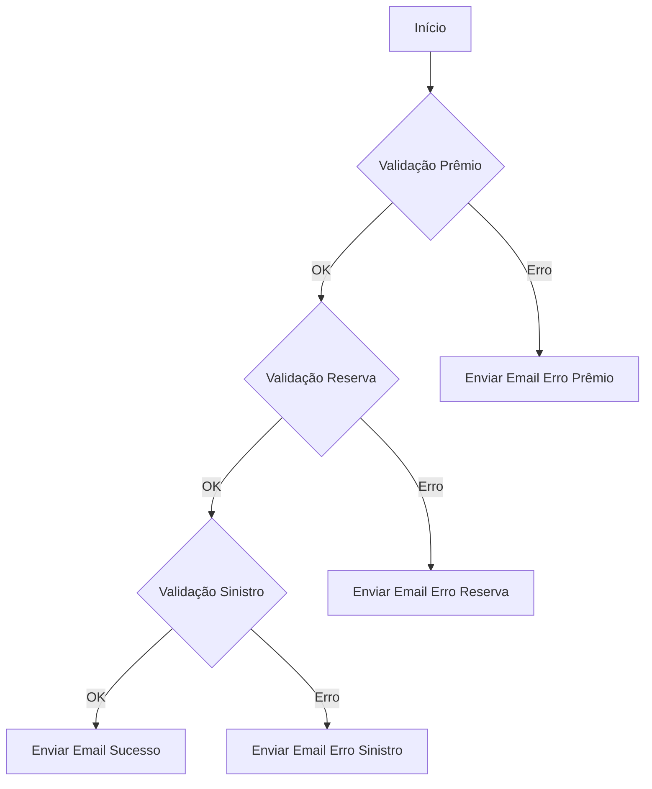

# APACHE_HOP_99_RELATORIOS

    

Projeto de ETL utilizando Apache Hop para orquestração e validação de relatórios de fechamento (prêmio, reserva, sinistro) com automação de notificações por e-mail.

---

## Sumário
- [Descrição Geral](#descricao-geral)
- [Estrutura de Pastas](#estrutura-de-pastas)
- [Detalhamento dos Arquivos e Processos](#detalhamento-dos-arquivos-e-processos)
- [Fluxogramas dos Principais Processos](#fluxogramas-dos-principais-processos)
- [Como Executar](#como-executar)
- [Requisitos](#requisitos)

---

## Descrição Geral { #descricao-geral }
Este projeto tem como objetivo automatizar a validação e o controle de importação de dados de relatórios de fechamento (prêmio, reserva e sinistro), além de enviar notificações por e-mail em caso de falhas ou sucesso. Utiliza Apache Hop para orquestrar os fluxos ETL, garantindo modularidade e fácil manutenção.

---

## Estrutura de Pastas
```
├── 01_JOB_VALIDACAO.hwf
├── ENVIAR_EMAIL.hpl
├── VERIFICAR_IMPORTACAO_FECHAMENTO_PREMIO.hpl
├── VERIFICAR_IMPORTACAO_FECHAMENTO_RESERVA.hpl
├── VERIFICAR_IMPORTACAO_FECHAMENTO_SINISTRO.hpl
├── project-config.json
├── README.md
├── README_HOP.prompt.md
```

---

## Detalhamento dos Arquivos e Processos

### Raiz do Projeto
- 01_JOB_VALIDACAO.hwf: Job principal de orquestração, responsável por coordenar a execução dos pipelines de validação e disparo de e-mails.
- ENVIAR_EMAIL.hpl: Pipeline para envio de e-mails de notificação sobre o status das importações.
- VERIFICAR_IMPORTACAO_FECHAMENTO_PREMIO.hpl: Pipeline de validação e importação dos dados de fechamento de prêmio.
- VERIFICAR_IMPORTACAO_FECHAMENTO_RESERVA.hpl: Pipeline de validação e importação dos dados de fechamento de reserva.
- VERIFICAR_IMPORTACAO_FECHAMENTO_SINISTRO.hpl: Pipeline de validação e importação dos dados de fechamento de sinistro.
- project-config.json: Arquivo de configuração do projeto Hop.
- README_HOP.prompt.md: Modelo e instruções para padronização da documentação.

---

## Fluxogramas dos Principais Processos

### Orquestração Principal (Job Validação)


---

## Como Executar
1. Abra o Apache Hop GUI.
2. Importe o projeto ou navegue até a pasta do repositório.
3. Execute o job principal localizado em `01_JOB_VALIDACAO.hwf`.
4. Acompanhe os logs e resultados pela interface do Hop.

## Requisitos
- Apache Hop instalado ([documentação oficial](https://hop.apache.org/))
- Java 8+

---
##  Contato

Para dúvidas, sugestões ou reportar problemas:

| Canal | Informação |
|-------|------------|
| **Email** | [thiago.ramalho@kovr.com.br](mailto:thiago.ramalho@kovr.com.br) |
| **Email** | [usrpbi@kovr.com.br](mailto:usrpbi@kovr.com.br) |

