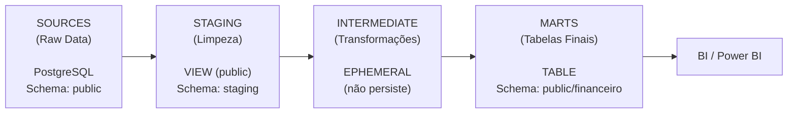
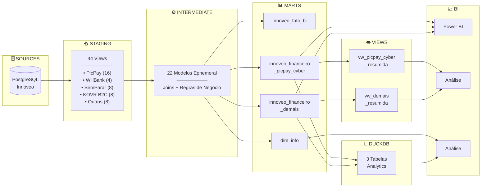

# 📊 DBT_KOVR_INNOVEO

  


Pipeline de transformação de dados financeiros da plataforma **Innoveo** para geração de tabelas analíticas de seguros.

---

## 📑 Sumário

- [🎯 Objetivo do Projeto](#-objetivo-do-projeto)

- [🏗️ Arquitetura de Modelagem](#️-arquitetura-de-modelagem)

- [📊 Diagrama de Linhagem](#-diagrama-de-linhagem)

- [📦 Produtos e Fontes de Dados](#-produtos-e-fontes-de-dados)

- [🔧 Macros Customizadas](#-macros-customizadas)

- [🧪 Qualidade de Dados](#-qualidade-de-dados)

- [⚙️ Configuração do Ambiente](#️-configuração-do-ambiente)

- [🚀 Comandos Principais](#-comandos-principais)

- [📚 Documentação e Linhagem](#-documentação-e-linhagem)

- [🌐 Documentação Publicada (dbt)](#-documentação-publicada-dbt)

- [🏷️ Tags do Projeto](#️-tags-do-projeto)

- [📁 Estrutura de Pastas](#-estrutura-de-pastas)

---

## 🎯 Objetivo do Projeto

Este projeto dbt transforma **dados brutos** da plataforma Innoveo em **tabelas de negócio** prontas para consumo em ferramentas de BI .

### Escopo

| Aspecto | Descrição |
|---------|-----------|
| **Domínio** | Financeiro / Seguros |
| **Volume** | ~20+ produtos de seguros |
| **Parceiros** | PicPay, WillBank, SemParar, KOVR, XP, Disney, Natura, Metlife |
| **Destino** | Data Warehouse PostgreSQL (KOVR_DW) |
| **Consumidores** | Dashboards de BI, Relatórios Financeiros |

### Valor Entregue

- ✅ **Padronização** de dados de múltiplos parceiros em um modelo unificado

- ✅ **Rastreabilidade** completa da linhagem de dados (source → marts)

- ✅ **Qualidade** garantida por testes automatizados

- ✅ **Documentação** auto-gerada e sempre atualizada

---

## 🏗️ Arquitetura de Modelagem

O projeto segue a arquitetura **Staging → Intermediate → Marts**, padrão recomendado pelo dbt:



### Camadas Detalhadas

#### 1️⃣ Staging (`models/staging/`)

| Aspecto | Especificação |
|---------|---------------|
| **Propósito** | Limpeza inicial, renomeação de colunas, tipagem básica |
| **Materialização** | `VIEW` |
| **Schema** | `staging` |
| **Nomenclatura** | `stg_{source}_{entity}` (ex: `stg_picpay_cyber_infos`) |
| **Regras** | 1:1 com source, sem joins, sem regras de negócio |


#### 2️⃣ Intermediate (`models/intermediate/`)

| Aspecto | Especificação |
|---------|---------------|
| **Propósito** | Joins complexos, regras de negócio, agregações intermediárias |
| **Materialização** | `EPHEMERAL` (não persiste no banco) |
| **Schema** | N/A (efêmero) |
| **Nomenclatura** | `int_{domain}_{entity}` (ex: `int_picpay_cyber`) |
| **Regras** | Joins entre stagings, aplicação de macros de negócio |


#### 3️⃣ Marts (`models/marts/`)

| Aspecto | Especificação |
|---------|---------------|
| **Propósito** | Tabelas finais para consumo analítico (Fatos e Dimensões) |
| **Materialização** | `TABLE` |
| **Schema** | `public` |
| **Nomenclatura** | `fato_{domain}`, `dim_{entity}` (ex: `innoveo_fato_bi`) |
| **Regras** | Pronto para BI, documentação obrigatória, testes críticos |

---

## 📊 Diagrama de Linhagem



### Resumo das Camadas

| Camada | Materialização | Qtd | Descrição |
|--------|----------------|-----|-----------|
| **Staging** | VIEW | 44 | Limpeza e padronização dos dados brutos |
| **Intermediate** | EPHEMERAL | 22 | Joins e aplicação de regras de negócio |
| **Marts (Fatos)** | TABLE | 3 | Tabelas de fatos para análise |
| **Marts (Dimensões)** | TABLE | 1 | Dimensões de suporte |
| **Views** | VIEW | 2 | Visões resumidas para BI |
| **DuckDB** | TABLE | 3 | Exportação para analytics local |

### Parceiros por Produto

| Parceiro | Produtos | Modelos Staging |
|----------|----------|-----------------|
| **PicPay** | Cyber, Phone, Auto, Residencial, Saúde, Empréstimo, Vida, Fatura | 16 |
| **SemParar** | Auto, Auto Diário, Viagem, Prestamista | 6 |
| **KOVR B2C** | AP, Phone, Vida, Disney AP | 8 |
| **WillBank** | Carteira, Celular | 4 |
| **Outros** | Natura, Metlife, Banco Fitness, XP | 8 |

---

## 📦 Produtos e Fontes de Dados

### Sources Configurados

| Source | Schema | Produtos | Tabelas |
|--------|--------|----------|---------|
| `picpay` | public | Cyber, Phone, Residencial, Auto, Saúde, Empréstimo, Vida, Fatura | 16 |
| `willbank` | public | Carteira, Celular | 4 |
| `semparar` | public | Auto, Auto Diário, Viagem, Prestamista | 6 |
| `kovr_b2c` | public | AP, Phone, Vida | 6 |
| `outros` | public | Disney AP, Natura Residencial, Metlife Celular, Banco Fitness, XP Card | 10 |

### Estrutura das Tabelas Fonte

Cada produto possui duas tabelas principais:

| Sufixo | Conteúdo | Exemplos de Campos |
|--------|----------|-------------------|
| `*_infos` | Dados de emissão/apólice | `uuid_bilhete`, `status_bilhete`, `data_vigencia` |
| `*_parcelas` | Dados financeiros | `valor_parcela`, `data_pagamento`, `data_vencimento` |

---

## 🔧 Macros Customizadas

### Macros de Negócio (`macros/regras_negocio_innoveo/`)

| Macro | Propósito | Exemplo de Uso |
|-------|-----------|----------------|
| `gerar_chave_unica` | Cria chave composta para identificação única | `{{ gerar_chave_unica('uuid_bilhete', 'uuid_parcela') }}` |
| `gerar_data_base` | Padroniza campos de data | `{{ gerar_data_base('data_pagamento') }}` |
| `ajuste_fif` | Aplica regras de cálculo do FIF | `{{ ajuste_fif('valor_fif') }}` |
| `ajuste_cd_evento` | Padroniza códigos de evento | `{{ ajuste_cd_evento('cd_evento') }}` |
| `ajuste_nm_evento` | Padroniza nomes de evento | `{{ ajuste_nm_evento('nm_evento') }}` |
| `max_data_modificacao` | Retorna a maior data de modificação | `{{ max_data_modificacao() }}` |
| `create_indexes` | Cria índices nas tabelas finais | `{{ create_indexes('tabela', ['col1']) }}` |

### Macros DuckDB (`macros/macros_duckdb/`)

| Macro | Propósito |
|-------|-----------|
| `importar_tabela_duckdb` | Importa dados do PostgreSQL para DuckDB |
| `pg_conn` | Gerencia conexão com PostgreSQL |
| `etl_duck_agrupamento_emissao` | Agrupa dados de emissão para DuckDB |
| `etl_innoveo_fato_bi_cancelamento` | Processa cancelamentos para BI |

---

## 🧪 Qualidade de Dados

### Pirâmide de Testes

```
                    ▲
                   /█\         Testes de Negócio
                  /███\        (Regras específicas)
                 /█████\
                /███████\      Testes de Integridade
               /█████████\     (relationships)
              /███████████\
             /█████████████\   Testes Básicos
            /███████████████\  (unique, not_null)
           ▀▀▀▀▀▀▀▀▀▀▀▀▀▀▀▀▀▀▀
```

### Tipos de Testes

| Tipo | Descrição | Exemplo |
|------|-----------|---------|
| `unique` | Garante unicidade de chaves | `uuid_bilhete` deve ser único |
| `not_null` | Garante preenchimento obrigatório | `status_bilhete` não pode ser nulo |
| `relationships` | Valida integridade referencial | `uuid_bilhete` existe na tabela pai |
| `accepted_values` | Valida valores permitidos | `status_bilhete` in ('Ativo', 'Cancelado') |

---

## ⚙️ Configuração do Ambiente

### Pré-requisitos

- Python 3.11+

- Poetry (gerenciador de dependências)

- PostgreSQL 15+ (acesso ao DW)

- Git

### 1. Clone e Instale

```bash
git clone https://github.com/kovr/dbt_innoveo_pipeline.git
cd dbt_innoveo_pipeline
poetry install
poetry run dbt deps
```

### 2. Configure Variáveis de Ambiente

**PowerShell:**
```powershell
$env:PG_DBNAME = "KOVR_DW"
$env:PG_USER = "postgres"
$env:PG_PASSWORD = "sua_senha"
$env:PG_HOST = "10.101.2.20"
$env:PG_PORT = "5432"
$env:DBT_PROFILES_DIR = (Resolve-Path .).Path
```

**Bash/Linux:**
```bash
export PG_DBNAME="KOVR_DW"
export PG_USER="postgres"
export PG_PASSWORD="sua_senha"
export PG_HOST="10.101.2.20"
export PG_PORT="5432"
export DBT_PROFILES_DIR=$(pwd)
```

### 3. Valide a Conexão

```bash
poetry run dbt debug --target dev
```

---

## 🚀 Comandos Principais

### Comandos Essenciais

```bash
# Validar configuração
poetry run dbt debug --target prod

# Executar todos os modelos
poetry run dbt run --target prod

# Executar testes
poetry run dbt test --target prod

# Gerar documentação
poetry run dbt docs generate --target prod

# Servir documentação
poetry run dbt docs serve --target prod --port 8082
```

### Execução Seletiva

```bash
# Por tag
poetry run dbt run --select tag:Financeiro
poetry run dbt run --select tag:picpay

# Por camada
poetry run dbt run --select staging.*
poetry run dbt run --select marts.*

# Modelo + dependências
poetry run dbt run --select +innoveo_fato_bi+

# Full refresh
poetry run dbt run --full-refresh --target prod
```

---

## 📚 Documentação e Linhagem

## 🌐 Documentação Publicada (dbt)

A documentação completa do projeto — modelos, linhagem, macros e sources — é gerada automaticamente pelo dbt e está publicada em:

> **🔗 [https://lucasilvape.github.io/dbt_kovr_innoveo/#!/overview](https://lucasilvape.github.io/dbt_kovr_innoveo/#!/overview)**

### Gerar e Servir Localmente

```bash
poetry run dbt docs generate --target prod
poetry run dbt docs serve --target prod --port 8082
```

Acesse localmente: **http://localhost:8082**

### Estrutura

```
docs/
├── overview.md      # Página inicial customizada
└── common.md        # Blocos de documentação reutilizáveis

assets/
└── style.css        # Tema customizado (verde KOVR)
```

---

## 🏷️ Tags do Projeto

| Tag | Descrição | Comando |
|-----|-----------|---------|
| `staging` | Camada de staging | `dbt run -s tag:staging` |
| `intermediate` | Camada intermediate | `dbt run -s tag:intermediate` |
| `marts` | Camada de marts | `dbt run -s tag:marts` |
| `Financeiro` | Domínio financeiro | `dbt run -s tag:Financeiro` |
| `BI` | Modelos de BI | `dbt run -s tag:BI` |
| `picpay` | Produtos PicPay | `dbt run -s tag:picpay` |

---

## 📁 Estrutura de Pastas

```
dbt_innoveo_pipeline/
├── 📄 dbt_project.yml          # Configuração principal
├── 📄 profiles.yml             # Conexões (gitignore)
├── 📄 pyproject.toml           # Dependências Python
├── 📄 README.md                # Esta documentação
│
├── 📂 models/
│   ├── 📂 staging/             # Views de limpeza
│   ├── 📂 intermediate/        # Transformações ephemeral
│   ├── 📂 marts/               # Tabelas finais
│   └── 📂 duckdb/              # Modelos DuckDB
│
├── 📂 macros/
│   ├── 📂 regras_negocio_innoveo/
│   └── 📂 macros_duckdb/
│
├── 📂 seeds/                   # Dados estáticos (CSV)
├── 📂 tests/                   # Testes customizados
├── 📂 docs/                    # Documentação customizada
├── 📂 assets/                  # CSS e imagens
├── 📂 target/                  # Artefatos (gitignore)
└── 📂 logs/                    # Logs (gitignore)
```


---

## 📞 Contato

Para dúvidas, sugestões ou reportar problemas:

| Canal | Informação |
|-------|------------|
| **Email** | [usrpbi@kovr.com.br](mailto:usrpbi@kovr.com.br) |
<!-- | :material-microsoft-teams: **Teams** | Canal "Equipe de Dados" | -->

---

## 👥 Contribuidores

- **Thiago Ramalho** - Thiago.Ramalho@kovr.com.br
- **Matheus Araujo** - Matheus.Oliveira@kovr.com.br
---

<!-- ## 🕐 Última atualização

> **Data:** 10/03/2026  
> **Responsável:** Lucas Silva Pereira -->

 