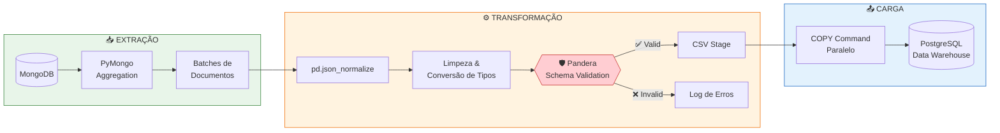

# Pipelines MongoDB


     


---

## 🎯 Objetivo do Projeto

Este repositório contém uma **engine de pipelines ETL** projetada para automatizar a extração de dados brutos de **collections MongoDB** (ambiente NoSQL de produção) e realizar a carga estruturada em **tabelas PostgreSQL** (Data Warehouse relacional).

### Por que este projeto existe?

| Desafio | Solução |
|---------|---------|
| Dados semi-estruturados no MongoDB dificultam queries analíticas | Transformação para schema relacional otimizado para BI |
| Necessidade de histórico e rastreabilidade | Colunas de auditoria (`_created`, `_modified`) preservadas |
| Alto volume de dados exige performance | Processamento paralelo com Joblib + operações em lote |
| Qualidade de dados inconsistente | Validação rigorosa de schemas com Pandera |

### Collections Processadas

```
📦 MongoDB (Origem)
├── 📄 implementations/infos    → Dados de Produtos e Apólices
└── 📄 installments/parcelas    → Dados Financeiros e Parcelas

📦 PostgreSQL (Destino)
├── 🗃️ innoveo_<produto>_infos     → Tabela de Informações
└── 🗃️ innoveo_<produto>_parcelas  → Tabela de Parcelas
```

---

## 🏗️ Arquitetura do Pipeline

O pipeline segue o padrão **ETL (Extract, Transform, Load)** com validação de dados integrada:


<!-- 
### Fluxo Detalhado

| Etapa | Componente | Descrição |
|-------|------------|-----------|
| **1. Extração** | `conexao_mongo.py` | Conexão via PyMongo, aggregation pipelines otimizados com projeções |
| **2. Transformação** | `pipeline_*_funcoes.py` | Normalização JSON → DataFrame, tratamento de tipos, cálculos derivados |
| **3. Validação** | `Pandera Schemas` | Validação strict de tipos, nullable, constraints e formatos |
| **4. Staging** | `CSV Files` | Exportação intermediária para arquivos CSV (buffer de carga) |
| **5. Carga** | `conexao_postgres.py` | `COPY` command paralelo, gestão de índices, transações atômicas | -->

---

## 🔄 Modos de Atualização

O pipeline suporta **4 modos de operação** para diferentes cenários de carga:

| Modo | Comando | Comportamento | Quando Usar |
|------|---------|---------------|-------------|
| 🗓️ **DIARIO** | `--tp_atualizacao DIARIO` | Processa apenas registros de uma data específica (`--data_busca`) | Reprocessamento pontual de um dia |
| 📈 **INCREMENTAL** | `--tp_atualizacao INCREMENTAL` | Processa registros modificados nos últimos N dias | Atualizações diárias de rotina |
| 🔄 **FULL** | `--tp_atualizacao FULL` | `TRUNCATE` + recarga completa da tabela | Migrações, correções em massa |
| 🤖 **DINAMICO** | `--tp_atualizacao DINAMICO` | Escolhe automaticamente entre FULL ou INCREMENTAL | **Recomendado para produção** |

<!-- ### Lógica do Modo DINÂMICO

```python
if percentual_modificacoes > PERCENTUAL_MODIFICACAO_INCREMENTAL:
    executar_modo_FULL()      # Mais eficiente para grandes volumes
else:
    executar_modo_INCREMENTAL()  # Menor impacto para poucas mudanças
``` -->

---

## 🛠️ Configuração e Instalação

### Pré-requisitos

- **Python 3.11+**

- **Poetry** (gerenciador de dependências)

- Acesso de rede ao **MongoDB** e **PostgreSQL**

### Instalação

```bash
# 1. Clone o repositório
git clone https://github.com/KovrSeguradoraBI/PIPELINES_MONGODB.git
cd PIPELINES_MONGODB

# 2. (Opcional) Configure o Poetry para criar venv no projeto
poetry config virtualenvs.in-project true

# 3. Instale as dependências
poetry install

# 4. Ative o ambiente virtual
poetry env activate
```

---

## 🔐 Variáveis de Ambiente

Copie o exemplo de configuração e preencha as credenciais locais:

```bash
cp .env.example .env
# Em Windows PowerShell:
# copy .env.example .env
```

Edite o arquivo `.env` gerado com as URIs do MongoDB e as credenciais do PostgreSQL antes de executar os pipelines.

---

## 🚀 Execução

### Argumentos de Linha de Comando

| Argumento | Tipo | Default | Descrição |
|-----------|------|---------|-----------|
| `--tp_atualizacao` | `str` | `DIARIO` | Modo de atualização (DIARIO/INCREMENTAL/FULL/DINAMICO) |
| `--qde_dias_retroativos` | `int` | `6` | Dias retroativos para busca incremental |
| `--percentual_modificacao_incremental` | `int` | `30` | Limite % para escolha FULL vs INCREMENTAL |
| `--qde_bilhetes` | `int` | `4000` | Tamanho do lote de processamento |
| `--qde_jobs` | `int` | `30` | Número de workers paralelos |
| `--data_busca` | `str` | `None` | Data específica (YYYY-MM-DD) para modo DIARIO |
| `--ambiente` | `str` | `ANALYTICS` | Ambiente de conexão (PRODUCAO/HOMOLOGACAO/ANALYTICS) |

### Exemplos de Execução

```bash
# 🤖 Modo DINÂMICO (recomendado para produção)
poetry run python kovr_ap/main_kovr_ap.py --tp_atualizacao DINAMICO --ambiente PRODUCAO

# 📈 Modo INCREMENTAL com 3 dias retroativos
poetry run python kovr_ap/main_kovr_ap.py \
    --tp_atualizacao INCREMENTAL \
    --qde_dias_retroativos 3 \
    --qde_jobs 50

# 🔄 Modo FULL (recarga completa)
poetry run python kovr_ap/main_kovr_ap.py --tp_atualizacao FULL --ambiente PRODUCAO

# 🗓️ Modo DIÁRIO para data específica
poetry run python kovr_ap/main_kovr_ap.py \
    --tp_atualizacao DIARIO \
    --data_busca 2026-01-15
```

<!-- ---


### 🚄 Processamento Paralelo com Joblib

O pipeline utiliza `joblib.Parallel` para maximizar throughput:

```python
from joblib import Parallel, delayed

# Exportação paralela de dados
Parallel(n_jobs=QDE_JOBS, backend='threading')(
    delayed(exportar_dados_csv)(ambiente, dia, pipelines)
    for dia in tqdm(lista_dias)
)

# Carga paralela no PostgreSQL
Parallel(n_jobs=QDE_JOBS, backend='threading')(
    delayed(pg.atualizar_tabela_postgres_arquivo)(ambiente, arquivo, tp_att, tabela)
    for arquivo in tqdm(arquivos)
)
```

**Otimizações implementadas:**

- 🔹 Remoção de índices antes de carga FULL (recriação após)

- 🔹 `COPY` command ao invés de `INSERT` (10x mais rápido)

- 🔹 Garbage collection explícito para grandes DataFrames

- 🔹 Staging em CSV para desacoplar extração de carga -->


---

## 📊 Produtos Disponíveis

Lista dos produtos cobertos por este repositório:

- Banco Fitness

- Disney AP

- Kovr AP

- Kovr Phone

- Kovr Vida

- Metlife Celular

- Natura Residencial

- PicPay Auto

- PicPay Cyber

- PicPay Empréstimo

- PicPay Fatura

- PicPay Phone

- PicPay Residencial

- PicPay Saúde

- PicPay Vida Individual

- Sem Parar

- Sem Parar Autodiário

- Sem Parar Prestamista

- Sem Parar Viagem

- Telefonica Cyber

- Willbank Carteira

- Willbank Celular

- XP Card

> 📖 Consulte a [documentação completa](https://lucasilvape.github.io/doc2/) para detalhes de cada produto.

---

## 📚 Documentação

A documentação técnica completa está disponível via **MkDocs Material**:

```bash
# Servir documentação localmente
poetry run mkdocs serve

# Build para produção
poetry run mkdocs build

# Deploy para GitHub Pages
poetry run mkdocs gh-deploy
```

Acesse: [https://lucasilvape.github.io/doc2/)


---

## 👥 Contribuidores

| Nome | Role | Contato |
|------|------|---------|
| **Thiago Holanda Ramalho** | Especialista de Dados | Thiago.Ramalho@kovr.com.br |
| **Lucas Silva Pereira** | Desenvolvedor | lucas.silva@kev.tech |
| **Matheus Araujo Oliveira** | Analista de Dados Sênior | Matheus.Oliveira@kovr.com.br |
| **Ricardo Campos Lima Dufloth** | Gerente de Tecnologia Negócios | ricardo.dufloth@kovr.com.br |


---

## 📝 Licença

Este projeto é **proprietário** e de uso exclusivo da **Kovr Seguradora**.

---

<!-- <p align="center">
  <sub>Desenvolvido pela equipe de <strong>Dados</strong> da <strong>Kovr Seguradora</strong></sub>
</p> -->


